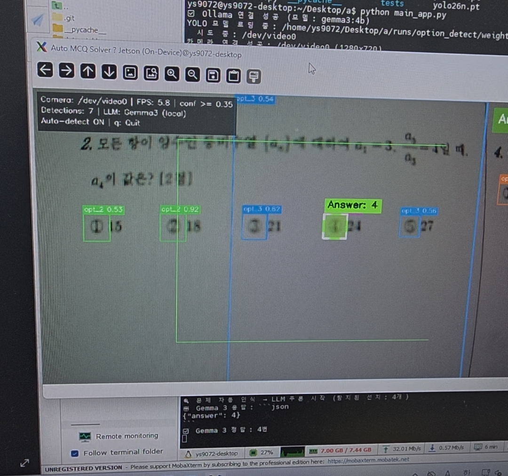

# MCQ Solver (Multiple Choice Question)

## 객관식 자동 정답 표시 시스템\nOn-Device MCQ Solver (with Jetson Orin Nano)

> **Jetson Orin Nano + oCam-5CRO-U + YOLOv11 + Gemma 3 4B (로컬)**  
> 카메라로 객관식 문제를 촬영하면 **수학·과학·언어·사회 등 어떤 분야든** 자동으로 정답을 탐지하여 실시간으로 표시하는 완전 오프라인 온디바이스 AI 시스템

---

## 📌 프로젝트 개요

카메라로 객관식 문제를 촬영하면:

1. **YOLOv11**이 선지(①~⑤)를 실시간으로 탐지
2. 선지가 안정적으로 감지되면 **자동으로** Gemma 3 로컬 추론 시작
3. **Gemma 3 4B**가 문제를 풀어 정답 번호를 반환
4. 정답 선지에 **반투명 형광펜 하이라이트** 오버레이

인터넷 연결·API 키 없이 **완전 오프라인**으로 동작합니다.

---

## 🎥 실행 영상

[실행 영상](https://www.youtube.com/shorts/-OuzQPkOn68?si=i5MJgcjgLY__kkfz&themeRefresh=1)

---

## 🔄 자동 인식 흐름

```
카메라 프레임
    │
    ▼
YOLOv11 선지 탐지 (30fps)
    │
    │ 선지 3개 이상 × 연속 10프레임 안정 감지
    ▼
┌─────────────────────────────────────────────┐
│ 화면 상태 배너 (우상단 실시간 표시)           │
│                                             │
│  [문제 인식 중] → [Gemma 3 solving...] →     │
│  [Answer: N]                                │
└─────────────────────────────────────────────┘
    │
    ▼
Gemma 3 Worker Thread (로컬 비전 추론)
    │
    ▼
정답 선지 Alpha Blending 하이라이트
```

---

## 🛠️ 시스템 구성

### 하드웨어

| 항목 | 사양 |
|---|---|
| 엣지 컴퓨팅 보드 | NVIDIA Jetson Orin Nano |
| 카메라 | Withrobot oCam-5CRO-U (글로벌 셔터 / USB 3.0) |
| 카메라 포맷 | YUYV, 1280×720, 30fps |

### 소프트웨어

| 항목 | 내용 |
|---|---|
| 선지 탐지 | **YOLOv11n** (Ultralytics, CUDA 가속) |
| 추론 엔진 | **Gemma 3 4B** (Q4_K_M, Ollama 로컬 서빙) |
| 영상 처리 | OpenCV + Alpha Blending |
| 비동기 처리 | Python threading |
| 언어 | Python 3 |

---

## 📁 프로젝트 구조

```
jetson_classification/
│
├── main_app.py              # ★ 메인 파이프라인 (자동 인식 + YOLOv11 + Gemma 3 + 전처리)
├── train_yolo.py            # YOLOv11 선지 탐지 모델 학습
├── export_tensorrt.py       # YOLOv11 .pt → TensorRT .engine 변환
├── capture_app.py           # 카메라 독립 프리뷰 (선택 사용)
│
├── runs/                    # YOLOv11 학습 결과 (자동 생성)
│   └── option_detect/weights/best.pt
│
├── On-Device.yolov11/       # 학습 데이터셋 (Roboflow, 151장)
├── dataset_bbox/            # 전처리된 학습 데이터 (자동 생성)
│
├── .gitignore
└── README.md
```

---

## ⚙️ 환경 설정

### 1. Python 의존성 설치

```bash
pip install opencv-python ultralytics ollama numpy
```

### 2. Ollama + Gemma 3 설치

```bash
# Ollama 설치
curl -fsSL https://ollama.com/install.sh | sh

# Gemma 3 4B 모델 다운로드 (~3.3 GB)
ollama pull gemma3:4b
```

### 3. 카메라 연결 확인

```bash
ls /dev/video*
```

> API 키·인터넷 연결이 **전혀 필요하지 않습니다.**

---

## 🚀 실행 방법

### Ollama 서버 시작 (최초 1회, 백그라운드)

```bash
ollama serve &
```

### 메인 실행 (자동 인식 모드)

```bash
python main_app.py
```

카메라에 객관식 문제지를 비추면 자동으로 분석이 시작됩니다.  
키 조작: `q` — 종료

#### 주요 옵션

| 옵션 | 기본값 | 설명 |
|---|---|---|
| `--camera` | auto | 카메라 장치 (`/dev/video0` 등) |
| `--model` | runs/.../best.pt | YOLOv11 모델 경로 |
| `--llm` | gemma3:4b | Ollama 모델명 |
| `--min-options` | 3 | 자동 추론 시작 최소 선지 수 |
| `--cooldown` | 15 | 재추론까지 쿨다운 (초) |
| `--conf` | 0.35 | YOLO 탐지 신뢰도 임계값 |

```bash
# 예시
python main_app.py --camera /dev/video1 --min-options 4 --cooldown 20
python main_app.py --model runs/option_detect/weights/best.engine  # TensorRT
```

### YOLOv11 모델 학습

```bash
python train_yolo.py
```

### TensorRT 변환 (추론 가속)

```bash
python export_tensorrt.py
```

---

## 🔧 구현 상세

### 자동 문제 인식 (Phase 기반 상태 머신)

| Phase | 조건 | 화면 배너 |
|---|---|---|
| `IDLE` | 대기 중 | — |
| `DETECTING` | 선지 3개+ 감지 중 | 🟠 `문제 인식 중 (N/5 options)` + 프로그레스 바 |
| `INFERRING` | Gemma 3 추론 중 | 🔵 `Gemma3 solving...` |
| `ANSWERED` | 정답 확정 | 🟢 `Answer: N` |
| `ERROR` | 오류 발생 | 🔴 `Error: ...` |

- **안정화 조건**: 선지 3개 이상을 **연속 10 프레임** 탐지 시 추론 시작
- **쿨다운**: 추론 완료 후 15초간 재추론 방지 (재촬영 시 리셋)

### 범용 프롬프트 엔지니어링

Gemma 3에 전달되는 프롬프트는 **모든 분야**를 처리합니다:

```
You are an expert at solving multiple-choice questions across all academic
subjects including mathematics, science, literature, social studies, and more.
Carefully read the question and all options shown in the image.
Apply logical reasoning and domain knowledge to determine the correct answer.
Return ONLY a JSON object with the answer number: {"answer": N}
where N is one of 1, 2, 3, 4, or 5. Do not include any explanation.
```

### YOLOv11 선지 탐지 모델

- 데이터셋: `On-Device.yolov11` (151장, Roboflow)
- 학습 결과: **mAP50 = 0.886**, mAP50-95 = 0.480
- 클래스: `opt_1`(①) ~ `opt_5`(⑤)
- 모델: YOLOv11n (2.58M params, 6.3 GFLOPs)

---

## 📊 성능

| 항목 | 수치 |
|---|---|
| YOLOv11 탐지 FPS | ~14 fps (Jetson Orin Nano, CPU) |
| YOLOv11 mAP50 | 0.886 |
| LLM 모델 | Gemma 3 4B (Q4_K_M, 3.3 GB) |
| LLM 추론 시간 | ~10–30초 (Jetson Orin Nano GPU) |
| 전체 메모리 사용 | ~5–6 GB |

> 전처리 파이프라인 (CLAHE + 샤프닝)으로 카메라 이미지 품질을 개선하여 탐지 성능을 향상시켰습니다.

---

## 📝 참고 사항

- **완전 오프라인 동작**: 모든 AI 추론(YOLOv11 + Gemma 3)이 Jetson 로컬에서 수행됩니다.
- Ollama 서버가 백그라운드에서 실행 중이어야 합니다 (`ollama serve`).
- Gemma 3 4B 모델은 약 3.3 GB 디스크 공간을 사용합니다.
- TensorRT `.engine` 파일은 빌드한 GPU 아키텍처에 종속됩니다 (Jetson ↔ PC 간 호환 불가).

---

## 📚 데이터셋
- 활용 데이터셋 : [EBS 모의고사](https://www.ebsi.co.kr/ebs/xip/xipa/retrieveSCVPreparation.ebs?irecord=202605073&targetCd=D300&cookieGradeVal=high3)
- 라벨링 데이터셋 : [MCQ Dataset](https://app.roboflow.com/zs-workspace-sdslq/mcq_solver/models)

---

## 📄 라이선스

본 프로젝트는 개인 연구/학습 목적으로 제작되었습니다.
